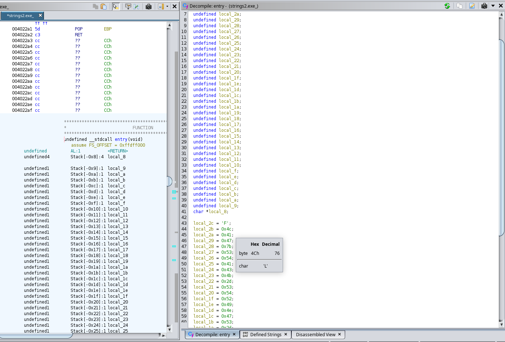

    Basic intro to malware RE

[The room](https://tryhackme.com/room/basicmalwarere)

strings1.exe

**download and extract the binary**

Load the binary to ghidra\
check entry function which gives this function

From the entry function we get a partial flag

open on the toolbar menu window -> defined strings and search to get the flag

    strings2

load the binary strings2.exe into ghidra

We see alot of variables defined with only one _local_2c_ having a value of 'F' (maybe a hint)

hovering over each value in ghidra shows the ascii character represented

Covert each into ascii you get the flag

(Copy into chatgpt and prompt it to format it for you :)
)

    strings3

load the binary strings3.exe into ghidra

At first glance it looks a little intimidating but we try to understand it piece by piece

In ghidra decompiled tab hover over the functions to get a brief overview of how it works if you have no idea what it means google :)

Double clicking at a particular function takes you to the function

In decompile tab it is empty but it also shows some content on the assembly tab so i start looking into the assembly not for anything in particular but just trial and error

While clicking on one of the functions and viewing the assembly code you get to see a partial flag

like we did in strings1 in defined strings
search for the partial flag we got and you will get the complete flag

N/B There are more ways to get the flag i simply found this to be the easy route with a bit of luck

To more deeply understand :

Research on all of the functions some are being called from other dll eg kernel32 and user32

For more details on PE structure i reccommend

[PE headers](https://tryhackme.com/room/dissectingpeheaders)
