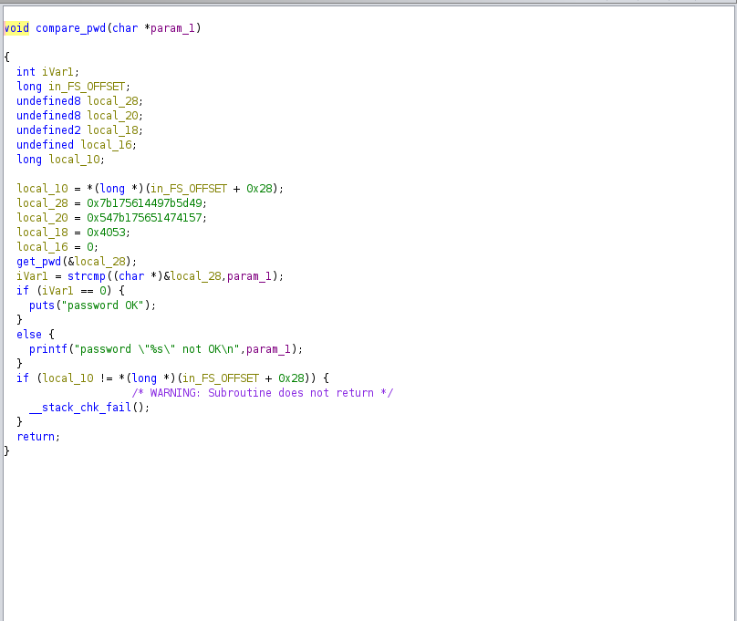

https://tryhackme.com/room/reverselfiles
Crackme1

chmod +x crackme1\
./crackme1

run above commands to get the flag

    Crackme2

chmod +x crackme2\
./crackme2\
 it gives message : Usage: ./crackme2 password

so it needs a password try: password

load the binary into ghidra

Here we see our input is being compared with _super_secret_password_

pass it as the password and get

    Crackme3

load into ghidra

strcmp which compares our input to a bae64 encoded string
_ZjByX3kwdXJfNWVjMG5kX2xlNTVvbl91bmJhc2U2NF80bGxfN2gzXzdoMW5nNQ==_

decode it to get the flag

    Crackme4

load into ghidra

Here we see a function _compare_pwd_ which takes in our input

Checking the compare_pwd function

We see that is compares our input with something stored in _*local_28*_

if the are equal ivar is set to 0 and _password Ok_ is printed

else _\*password not ok_\* is printed

we need to see what is stored in _local_28_

We will now use a debugger gdb

gdb crackme4

we then list functions in the binary

As always we target strcmp :)

Set a break point at memory address of this function

One break point is set run the binary

run yolo
Binary is executed until breakpoint is reached
we then view current state of the registers

info registers

rax and rdx are general purpose re gisters and from above we see that they have memory address values

To print strings at these addresses we use command

(gdb) x/s 0x7fffffffdad0

printing values at rax and rdx we get our input and the password

    Craackme5

load into ghidra

We see the strcmp again :)

which compares our input local_58 with what is stored in &local_38

To see what is stored at &local_38 we use our debugger

load the binary into gdb and check functions used

put a break point on strcmp then run

View what is sored in rax and rdx to get the password

    Crackme6

load into ghidra

we have a function compare_pwd which takes our input as argument

we check that function

There is another function my_secure_test()
we check this also

Here we a bunch of if satements that are used to check if our input matches

from this we can determine the password
13...

    Crackme7

We have 3 choices try all to see what the do

load the binary into ghidra

Here we see logic for each of the choices we make

particular interest on option 2 where it prints

"Wow such h4x0r!" if we give a particular value as our input

When we enter the value directly error so we need to convert it hex to decimal

    Crackme8

load into ghidra

atoi => converts a string into an integer numerical representation

convert the -0x35010ff3 value to decimal, which is -889262067 and then pass it as the password to the binary

